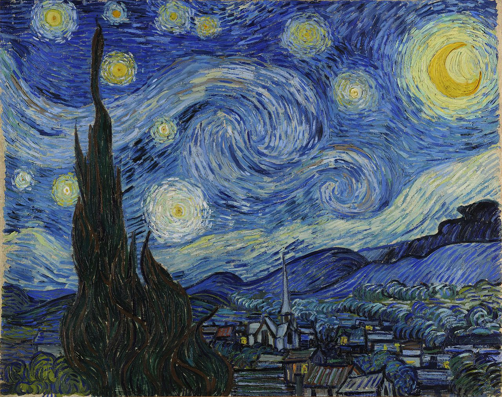

# Computer Vision Project

This repository contains a Jupyter Notebook for a computer vision project, part of the "Introduction to Machine Learning" course. The project explores two key concepts:
1.  **CNN from Scratch:** Implementing a basic convolutional layer (forward and backward pass) using NumPy.
2.  **Neural Style Transfer:** Using a pre-trained VGG-19 model with PyTorch to transfer the style of one image onto another.

**Course:** Introduction to Machine Learning
**Instructor:** Dr. Fatemeh Mirsalehi
**TA:** Amirhossein Razlighi

---

## 🚀 Getting Started

### Prerequisites

This project requires Python and several data science libraries. A virtual environment is recommended.

### 🛠️ Installation

1.  **Clone the repository:**
    ```bash
    git clone [https://github.com/YOUR_USERNAME/YOUR_REPOSITORY.git](https://github.com/YOUR_USERNAME/YOUR_REPOSITORY.git)
    cd YOUR_REPOSITORY
    ```

2.  **Create and activate a virtual environment (optional but recommended):**
    ```bash
    python -m venv venv
    source venv/bin/activate  # On Windows: venv\Scripts\activate
    ```

3.  **Install the required packages:**
    The notebook uses the following packages. You can install them via pip:
    ```bash
    pip install torch torchvision numpy matplotlib Pillow requests
    ```
    *Note: The notebook also uses `torchsummary` in one cell for model visualization. You may need to install it separately if you wish to run that specific cell:*
    ```bash
    pip install torchsummary
    ```

### 🏃 Running the Project

The entire project is contained in the `mian.ipynb` Jupyter Notebook.

1.  Ensure your environment is activated and packages are installed.
2.  Start Jupyter Lab or Jupyter Notebook:
    ```bash
    jupyter lab
    ```
3.  Open `mian.ipynb` and run the cells sequentially to see the implementation and results.

---

## 📓 Project Details

The notebook is divided into two main sections.

### Part 1: CNN from Scratch

This section focuses on understanding the fundamental mechanics of a convolutional layer.

* **`MyConv` Class:** A custom class built with NumPy that implements the `forward` and `backward` propagation for a 2D convolution.
* **Verification:** The implementation is tested against correct outputs and verified using numerical gradient checking (`rel_error` function).
* **Visualization:** The `MyConv` class is used to apply standard image processing filters (Grayscale, Sobel X/Y edge detection, Gaussian Blur) to sample images, demonstrating the effect of different convolution kernels.

### Part 2: Neural Style Transfer (NST)

This section implements the Neural Style Transfer technique, as described by Gatys et al.

* **Model:** It uses the feature-extraction layers of a **pre-trained VGG-19 model** (from `torchvision`) to capture image content and style.
* **Content Loss:** A `ContentLoss` module is defined, which computes the Mean Squared Error (MSE) between the feature maps of the content image and the generated image.
* **Style Loss:** A `StyleLoss` module is defined to compute the MSE between the **Gram matrices** of the style image's feature maps and the generated image's feature maps. This captures the correlations between features, representing texture and style.
* **Optimization:** The `LBFGS` optimizer is used to iteratively update a target image (initialized as a clone of the content image). The optimizer works to minimize a weighted sum of the total content loss and total style loss, gradually blending the content of one image with the style of another.

---

## 🎨 Results

The primary output of the project is the generated image from the Neural Style Transfer process. The notebook also plots the loss curves over the optimization iterations.

### Input Images

| Content Image | Style Image |
| :---: | :---: |
|  |  |

### Final Generated Image

The final image is generated in **Cell 73** after the optimization loop.


